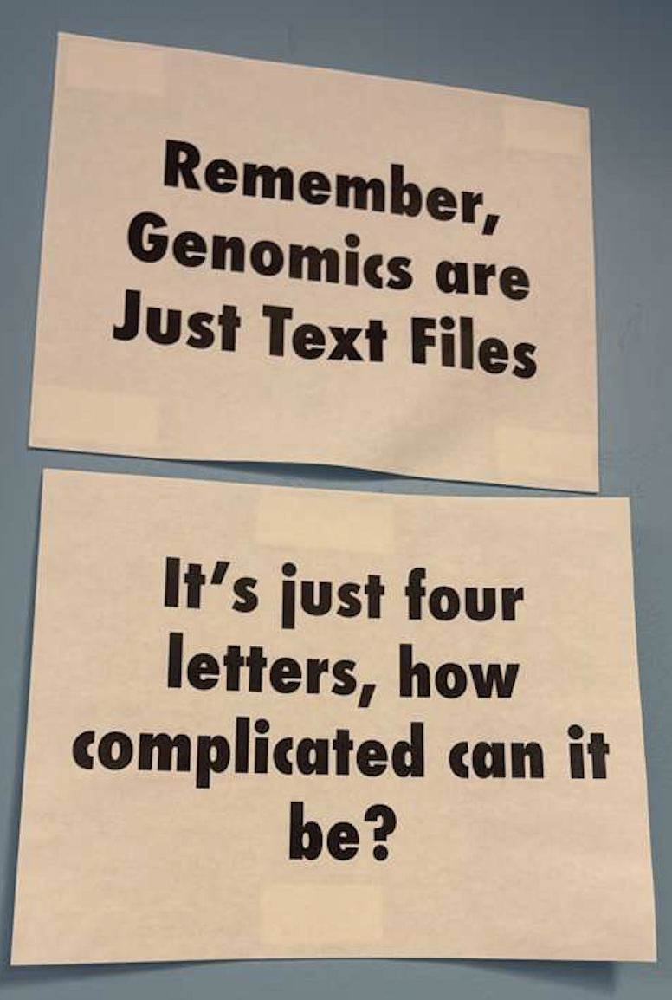

# Advanced Evolutionary Analysis

 

^ from the American Musem of Natural History Herpetology grad office

 

Folder containing papers discussed in class:

- [Papers for class](https://github.com/seanharrington256/evoanalysis/blob/main/papers)

 

Exercise using the shell for first class:

- [Unix shell exercise](https://swcarpentry.github.io/shell-novice/index.html)

 

A general introduction to to UW's MedicineBow computing cluster:

- [MedicineBow tutorial](https://github.com/seanharrington256/evoanalysis/blob/main/medbow_tutorial/medbow_tutorial.md)

 

Other online resources that will be useful as we work through course material: 

- Speciation Genomics Workshop (Meier and Ravignet) (https://speciationgenomics.github.io/)
 
 
 
 

- [Syllabus v1](https://github.com/seanharrington256/evoanalysis/blob/main/Advanced_Evolutionary_Analysis_Syllabus_v1.pdf)
