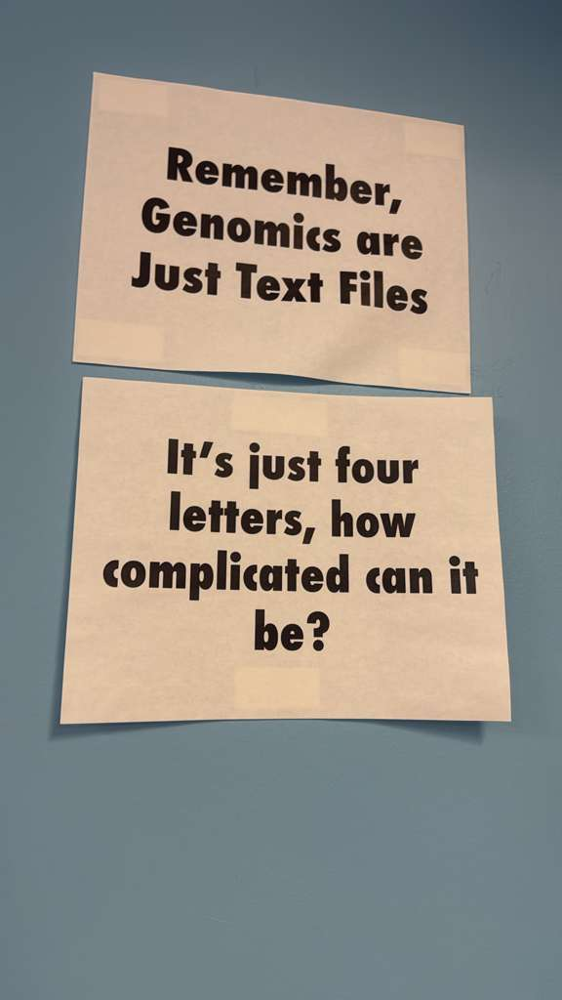

# Advanced Evolutionary Analysis

 

signs from the American Musem of Natural History Herpetology grad office:

 

- [MedicineBow tutorial](https://github.com/seanharrington256/evoanalysis/blob/main/medbow_tutorial/medbow_tutorial.md)

 

- [Papers for class](https://github.com/seanharrington256/evoanalysis/blob/main/papers)

 
 
 
 

- [Syllabus v1](https://github.com/seanharrington256/evoanalysis/blob/main/Advanced_Evolutionary_Analysis_Syllabus_v1.pdf)