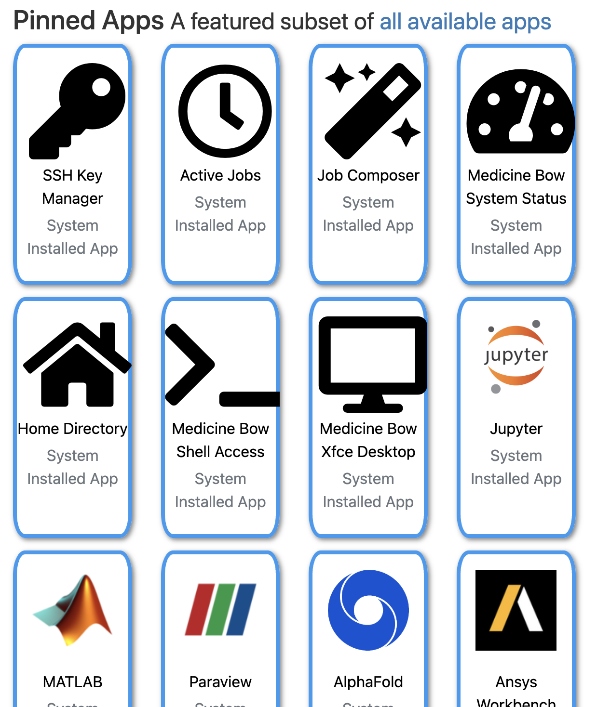
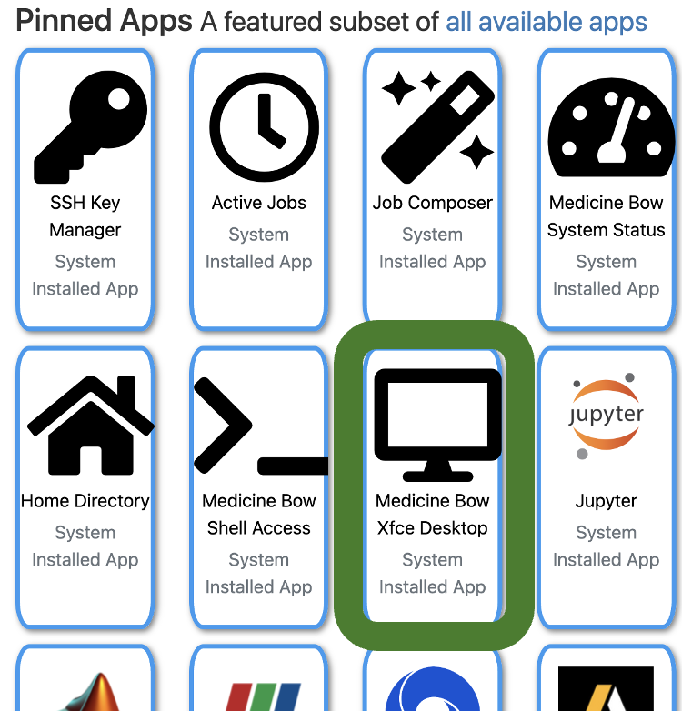
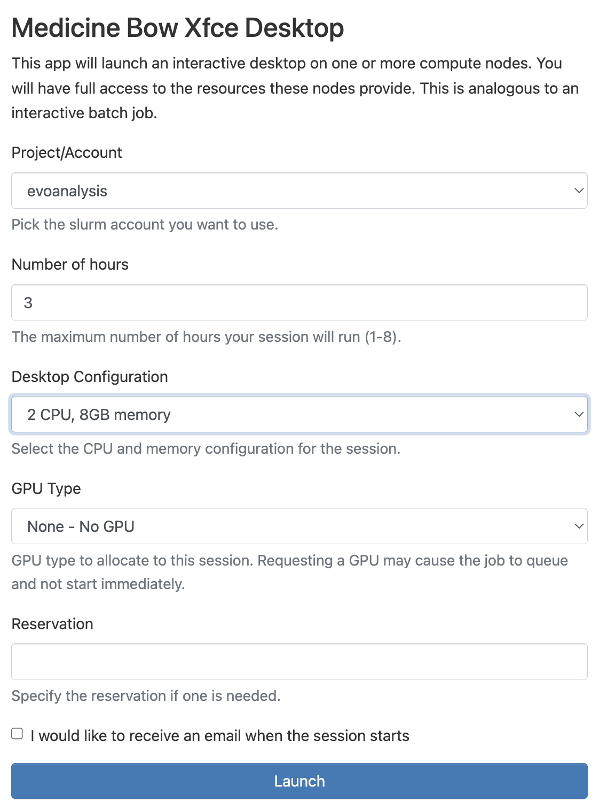
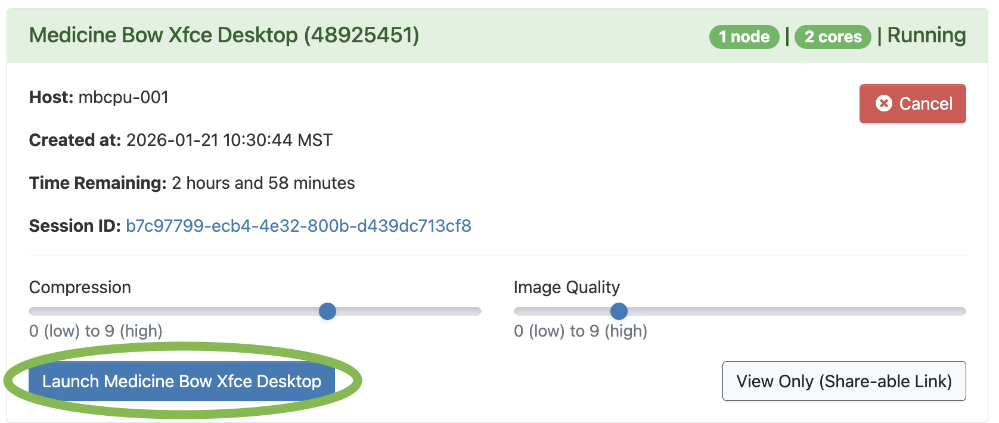
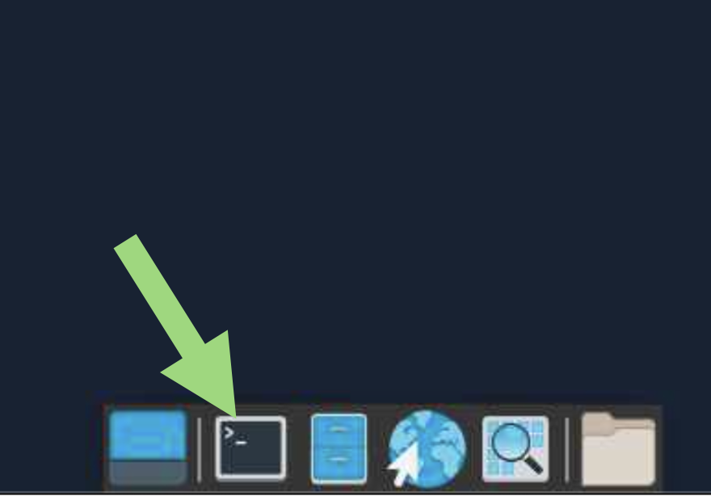

# RStudio on MedicineBow


<br>

[Home](https://github.com/seanharrington256/evoanalysis)

<br>


On MedicineBow, there are multiple ways to run analyses in R (these are not exhaustive): 


- Load up the R module, start R, and just run R interactively from the command line (I do not like to do this at all). 

- Write a script and then execute it non-interactively from the command line (e.g., `Rscript myscript.R`) -- I do this for scripts that I do not think have bugs or errors in them and that I do not need to interact with

- Use [VS Code](https://code.visualstudio.com/) and set it up to link with MedicineBow and R so that you can edit and run R code on MedicineBow from the VS Code editor on your local machine directly -- this is my personal favorite, but we won't go over it today. You can see documentation [here](https://code.visualstudio.com/docs/remote/ssh) if you want to pursue this

- Use Jupyter on MedicineBow via the OnDemand system that we'll explore below

- **Use RStudio to interactively write and execute an R script** - this is what we'll go over today


<br>
<br>


We'll use the MedicineBow OnDemand interface available through ARCC to run RStudio. You can access SouthPass at **[https://medicinebow.arcc.uwyo.edu/](https://medicinebow.arcc.uwyo.edu/)**. This will take you to a Wyo Login page, use your regular UW username and password to log in - you may also get a two-factor authentication push.


<center>

</center>


Assuming you set up your computer to access MedicineBow through the terminal and have an ssh key set up, you saw this page when you generated and downloaded you ssh key.


This page offers a number of ways to interact with MedicineBow, today we'll just use `Medicine Bow Xfce Desktop`. 


<center>

</center>


When you click on that icon, it will take you to a page that asks you to specify your project/account (this is the project that you put in when run an `salloc` session or in a slurm job script, e.g., everyone in this course can use `evoanalysis`).


We'll select `3 hours` and `2 CPU, 8GB memory` for our Desktop Configuration:


<center>

</center>


* You can select up to 32 CPUs with 512 GB of memory as of the writing of this tutorial. You should tailor your requested resources to the analyses you will be running.


Then click `launch`. You will be taken to a new page that will show the job as queued briefly for up to a few minutes, then you should see the option `Launch Medicine Bow Xfce Desktop` at the bottom when the job is ready. Click that to start the session. 


<center>

</center>


This will start up an interactive desktop session. This will look like a standard desktop, but you are running on a MedicineBow compute node--keep in mind that this means you are running Linux and hotkeys you're used to might not work. 


* **If you get asked about giving access to the clipboard, click `YES`** - if you click no, you will not be able to copy/paste into this window and it will make your life harder


To start up RStudio, open up the terminal emulator (either in the bottom bar or Applications in the top left).


<center>

</center>


In the terminal emulator, load the RStudio module and then start up RStudio (note that these versions change over time)

```
module load gcc/14.2.0 r/4.4.0 rstudio/2024.04.2
rstudio
```

That should open Rstudio, and you can proceed as you would typically, but with access to all of your files that are on MedicineBow.


<br>

If you need to uopdate R beyond what is available as a module on MedicineBow, you can install a specific version of R using conda. Some R packages can be problematic to install on MedicineBow, and you can often conda install these as well.


<br><br><br>
<br><br><br>


[Home](https://github.com/seanharrington256/evoanalysis)

<br><br><br>
<br><br><br>
<br><br><br>
<br><br><br>


